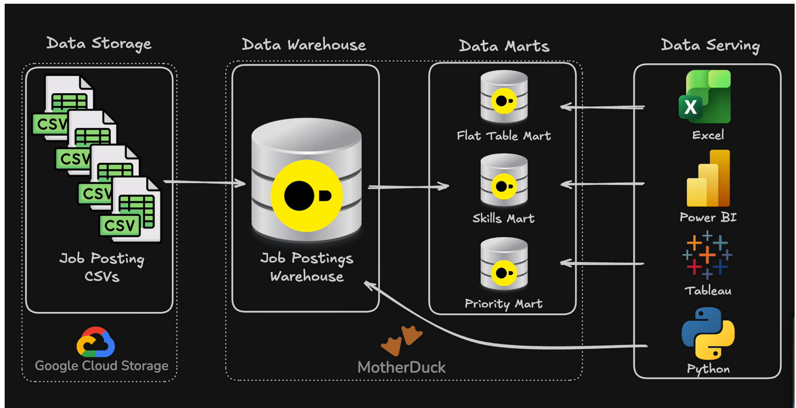
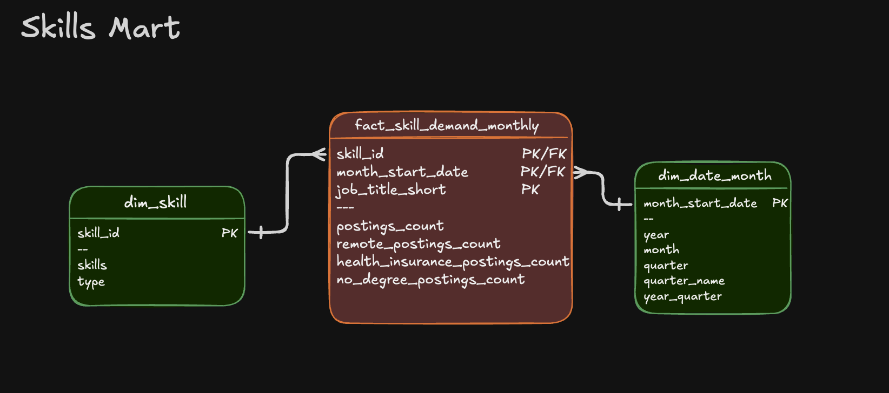
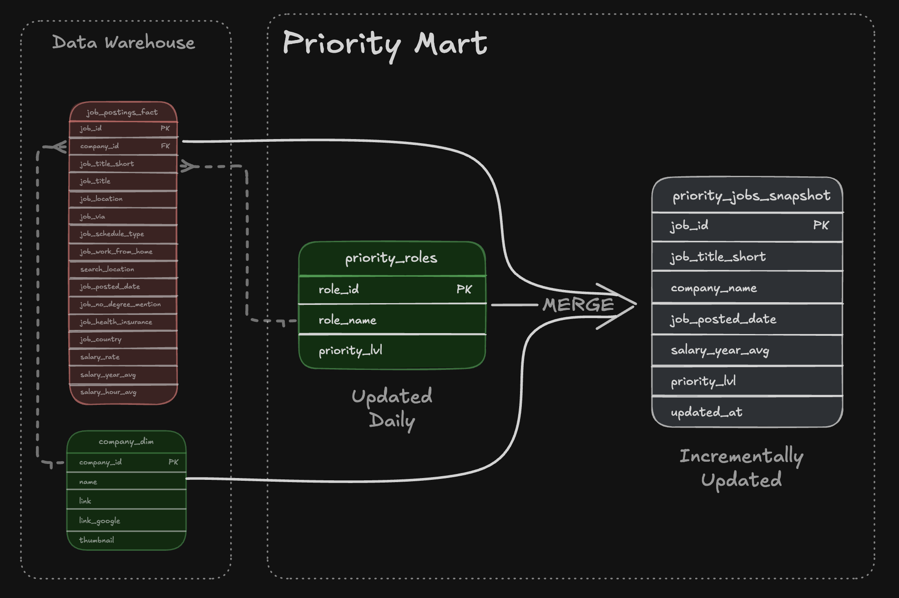
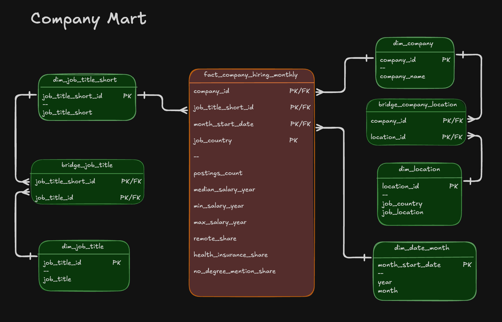

# Data Warehouse & Mart Build: Production ETL Pipeline

End-toend ETL pipeline transforming raw CSV files into a star schema data warehouse and analetical data marts.

### [2_WH_Mart_Build/](/2_DW_Mart_Build/) - Data Pipeline - Data Warehouse & Mart


## Executive Summary

- ✅ **End-to-End Pipeline:** Built a complete SQL-based ETL pipeline that transforms raw job-posting data into a structured data warehouse and purpose-built analytical data marts.
- ✅ **Dimensional Modeling:** Designed a star schema using fact, dimension, and bridge tables to organize job, company, and skills data for efficient analysis.
- ✅ **ETL & Data Quality:** Developed repeatable extraction, transformation, and loading processes with validation checks to maintain data consistency and reliability.
- ✅ **Analytical Data Marts:** Built specialized **flat, skills, and priority marts** to support different analytical needs, including skills-demand analysis and priority job-role tracking.
- ✅ **Incremental Processing:** Implemented `MERGE`-based update logic for the priority mart, allowing existing records to be updated and new records to be added efficiently.

## Problem & Context

**Challenge:** Raw job-posting data is useful for analysis, but working directly with source files can make reporting and analytical queries difficult to maintain, repetitive, and inefficient. A structured data warehouse provides a centralized and consistent foundation for organizing job, company, and skills data, while specialized data marts make frequently needed analytical datasets easier to query and use.

**Solution:** I built an end-to-end data pipeline that loads raw job-posting data from cloud-based CSV files into DuckDB, transforms the data into a star-schema warehouse, and then creates specialized analytical data marts for different use cases. The warehouse separates job facts from company and skills dimensions, while the flat, skills, and priority marts provide analysis-ready datasets for reporting, skills-demand analysis, and priority-role tracking. The pipeline is organized into modular SQL scripts and a master build script so the workflow can be executed consistently and maintained more easily.


## Tech Stack
- **Database:** DuckDB (file-based OLAP database with GCS integration via httpfs)
- **Language:** SQL (DDL for schema design, DML for data loading and transformation)
- **Data Model:** Star schema (fact + dimension + bridge tables)
- **Development:** VS Code for SQL editing + Terminal for DuckDB CLI execution
- **Automation:** Master SQL script for pipeline orchestration
- **Version** Control: Git/GitHub for versioned pipeline scripts
- **Storage:** Google Cloud Storage for source CSV files

## Repository Structure
```text
2_WH_Mart_Build/
├── 01_create_tables_dw.sql          # Star schema DDL
├── 02_load_schema_dw.sql            # GCS data extraction & loading
├── 03_create_flat_mart.sql          # Denormalized flat mart
├── 04_create_skills_mart.sql        # Skills demand mart
├── 05_create_priority_mart.sql      # Priority roles mart
├── 06_update_priority_mart.sql      # Priority mart incremental update (MERGE)
├── 07_create_company_mart.sql       # Company hiring mart (optional)
├── build_dw_marts.sql               # Master SQL build script
└── README.md                        # You are here
```

## Pipeline Architecture

### [2_WH_Mart_Build/](/2_DW_Mart_Build/) - Data Pipeline - Data Warehouse & Mart

The pipeline transforms job posting CSVs from Google
Cloud Storage into a normalized star schema data
warehouse, then builds speciNized analytical data marts. BI
tools (Excel, Power BI, Tableau, Python) consume from both
the warehouse and marts.

## Data Warehouse
The data warehouse implements a star schema with company_dim, skills_dim, job_postings_fact, and skills_job_dim tables.
### [2_WH_Mart_Build/](/2_DW_Mart_Build/) - Data Warehouse - Data Warehouse & Mart


- **SQL Files:**
   - [`01_create_tables_dw.sql`](./01_create_tables_dw.sql) – Defines star schema with 4 core tables

   - [`02_load_schema_dw.sql`](./02_load_schema_dw.sql) – Extracts CSVs from GCS and loads into warehouse tables
- **Purpose:** Star schema serving as single source of truth for analytical queries
**Grain:** One row per job posting in the fact table (job_postings_fact)

## Flat Mart 
Denormalized table with all dimensions for ad-hoc queries.

### [2_WH_Mart_Build/](/2_DW_Mart_Build/) - Flat Mart - Data Warehouse & Mart


- **SQL File:** [`03_create_flat_mart.sql`](./03_create_flat_mart.sql) – Builds denormalized table with all dimensions joined
- **Purpose:** Denormalized table for quick ad-hoc queries
- **Grain:** One row per job posting with all dimensions joined

### Skills Mart
Time-series skill demand analysis with additive measures.
### [2_WH_Mart_Build/](/2_DW_Mart_Build/) - Skills Mart - Data Warehouse & Mart

- **SQL File:** [`04_create_skills_mart.sql`](./04_create_skills_mart.sql) – Builds time-series skill demand mart
- **Purpose:** Time-series analysis of skill demand over time with additive measures
- **Grain:** `skill_id + month_start_date + job_title_short`
- **Key Features:** All  measures are additive (counts/sums) for safe re-aggregation

### Priority Mart
Priority role tracking with incremental updates using MERGE operations.
### [2_WH_Mart_Build/](/2_DW_Mart_Build/) - Priority Mart - Data Warehouse & Mart

- **SQL Files:**
  - [`05_create_priority_mart.sql`](./05_create_priority_mart.sql) – Initial build of priority roles and jobs snapshot
  - [`06_update_priority_mart.sql`](./06_update_priority_mart.sql) – Incremental update using MERGE (upsert pattern)
- **Purpose:** Track priority roles and job snapshots with incremental update capabilities
- **Grain:** One row per job posting with priority level assignment
- **Key Features:** MERGE operations for incremental updates - demonstrates production-ready upsert patterns (INSERT, UPDATE, DELETE in single statement)
### Company Mart
Company hiring trends by role, location, and month.
### [2_WH_Mart_Build/](/2_DW_Mart_Build/) - Company Mart - Data Warehouse & Mart

- **SQL File:** 07_create_company_mart.sql – Builds company hiring trends mart (optional)
- **Purpose:** Company hiring trends analysis by role, location, and month
- **Grain:** company_id + job_title_short_id + location_id + month_start_date
- **Key Features:** Bridge tables for many-to-many relationships (company-location, job title hierarchies)
- **Note:** This mart is optional and can be skipped if not needed

## 💻 Data Engineering Skills Demonstrated

### ETL Pipeline Development

- **Extract:** Loaded raw job-posting CSV data from Google Cloud Storage into DuckDB
- **Transform:** Cleaned, normalized, and transformed source data for analytical use
- **Load:** Loaded transformed data into a star-schema data warehouse and specialized data marts
- **Incremental Updates:** Implemented `MERGE`-based logic for updating the priority mart
- **Orchestration:** Used `build_dw_marts.sql` as the master SQL script for pipeline execution

### Dimensional Modeling

- **Star Schema Design:** Modeled job-posting data using fact and dimension tables
- **Fact Table:** Built `job_postings_fact` as the central fact table
- **Dimension Tables:** Created supporting dimensions including `company_dim` and `skills_dim`
- **Bridge Table:** Used `skills_job_dim` to support many-to-many relationships between jobs and skills
- **Data Marts:** Created specialized flat, skills, and priority marts for different analytical use cases

### SQL Techniques

- **DDL:** Used `CREATE SCHEMA`, `CREATE TABLE`, and `DROP TABLE` for database object management
- **DML:** Used `INSERT INTO ... SELECT` to transform and load warehouse and mart data
- **MERGE:** Implemented incremental update logic using `MERGE INTO`
- **CTEs:** Used Common Table Expressions to organize transformation logic
- **Data Transformation:** Applied SQL functions and conditional logic to prepare data for analysis
- **Aggregation:** Used grouping, counts, and other aggregations to build analytical datasets

### Data Quality & Production Practices

- **Idempotent Processing:** Designed scripts to be safely rerunnable
- **Data Validation:** Used validation queries to verify warehouse and mart results
- **Schema Organization:** Separated warehouse and mart objects into logical schemas
- **Modular SQL:** Organized the pipeline into separate SQL scripts for creation, loading, mart development, and updates
- **Version Control:** Managed project development using Git, GitHub, and a dedicated `develop/project-2` branch


